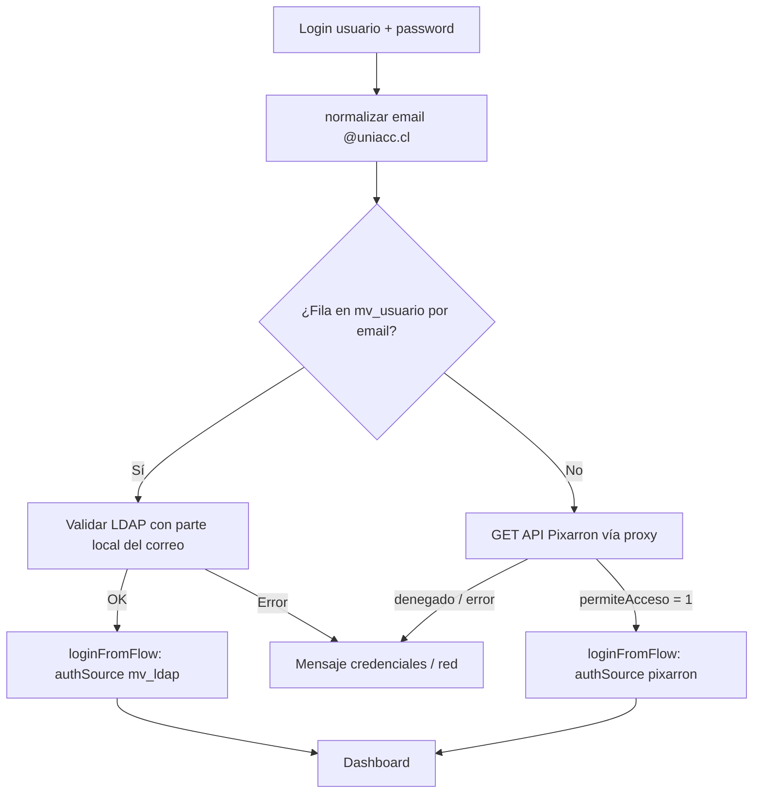

# Autenticación y sesión — Rematrícula Online

Documento de referencia para **desarrolladores**, **operaciones** y **asistentes de IA** que deban entender o modificar el flujo de inicio de sesión de esta aplicación Vue 3 + Pinia + Vite.

---

## 1. Resumen ejecutivo

- El usuario ingresa **usuario** y **contraseña** en la pantalla de login.
- El correo institucional se modela como **`parte_local@uniacc.cl`** (ver sección 4).
- **Si existe una fila** en Supabase, tabla **`mv_usuario`**, con ese **`email`**: se valida la contraseña contra **LDAP** (servicio externo).
- **Si no existe** en `mv_usuario`: se consulta el **API Pixarron** (`permiteAcceso`, `tipo`). Si permite acceso, el usuario entra sin pasar por LDAP.
- Las **credenciales del API Pixarron** (Basic Auth) **no** van al navegador: solo el **proxy de Vite** (desarrollo) o **nginx/Caddy** (producción) las añaden en servidor.
- La sesión se guarda en **`sessionStorage`** (sin contraseña).

---

## 2. Arquitectura del flujo

---

## 3. Archivos principales

| Ruta | Rol |
|------|-----|
| [`src/views/auth/LoginView.vue`](../src/views/auth/LoginView.vue) | Formulario; llama `runLoginFlow` y `auth.loginFromFlow`. |
| [`src/services/loginFlow.ts`](../src/services/loginFlow.ts) | Orquesta Supabase → LDAP o Pixarron; registra log de sesión exitoso. |
| [`src/services/loginAudit.ts`](../src/services/loginAudit.ts) | `registrarIntentoSesion` → RPC `registrar_log_inicio_sesion` (éxitos y fallos). |
| [`src/services/uniaccEmail.ts`](../src/services/uniaccEmail.ts) | Normaliza entrada a `usuario@uniacc.cl`. |
| [`src/services/ldapAuth.ts`](../src/services/ldapAuth.ts) | `POST /api/auth/ldap` → proxy → servicio LDAP. |
| [`src/services/pixarronAcceso.ts`](../src/services/pixarronAcceso.ts) | `GET` relativo al proxy Pixarron; parsea JSON (array u objeto). |
| [`src/services/supabaseClient.ts`](../src/services/supabaseClient.ts) | Cliente `@supabase/supabase-js` con URL/clave `VITE_*`. |
| [`src/stores/auth.ts`](../src/stores/auth.ts) | Estado de sesión, `perfil`, nombres, `displayNombreCompleto`. |
| [`src/types/supabase.ts`](../src/types/supabase.ts) | Tipos `Database`, `MvUsuarioRow`, `MvLibroMatriculaRow`, etc. |
| [`vite.config.ts`](../vite.config.ts) | Proxies de desarrollo: LDAP y Pixarron (+ Basic Auth). |
| Servicio LDAP (repo aparte, p. ej. `ldap-autenticacion`) | Ver documentación de ese proyecto en el mismo entorno de despliegue. |

---

## 4. Normalización del usuario / correo

- Si el usuario escribe solo `nombre.apellido`, se busca el email **`nombre.apellido@uniacc.cl`**.
- Si escribe **`algo@uniacc.cl`**, se valida el dominio y se usa ese correo (normalización de mayúsculas en la parte local según implementación actual).
- Otros dominios distintos de **`uniacc.cl`** se rechazan con mensaje claro.

Implementación: [`src/services/uniaccEmail.ts`](../src/services/uniaccEmail.ts).

---

## 5. Base de datos: `mv_usuario`

- La existencia del usuario se determina con:

  `select * from mv_usuario where email = '<email_normalizado>'` (vía cliente Supabase).

- Esquema esperado (Postgres), alineado al código:

  - `id` (uuid), `nombre_usuario`, `apellido_usuario`, `email`, `telefono`,
  - `codigo_estado_usuario`, `codigo_perfil_usuario`, `codigo_grupo`,
  - `updated_at`, `rut_modifica_usuario`.

- **RLS**: el rol **`anon`** de Supabase debe poder **leer** las filas necesarias para el login (o usar una **RPC / Edge Function** con `service_role`). Si la consulta falla por políticas, hay que ajustar políticas en Supabase.

### 5.1 Tabla `log_inicio_sesion` (auditoría de login)

- Registra **intentos de sesión** (éxitos y fallos; **nunca** contraseñas). Columnas relevantes: `exitoso` (boolean), `mensaje_error` (texto solo si falló), `email` / `usuario_local` (pueden ser null en fallos de validación temprana), `auth_source`, `tipo_pixarron`, `mv_usuario_id`, `url_origen`.
- **`auth_source`**: `mv_ldap` (validación LDAP), `pixarron` (API Pixarron), `validacion` (correo/usuario no válido antes de consultar BD), `supabase` (error al leer `mv_usuario`).
- **Riesgo de privacidad:** un log de fallos con identificadores permite **auditoría** pero también **enumeración** si alguien accede masivamente al histórico. Restringir lectura a **service_role** o cuentas admin; no exponer el log al cliente público.
- **Migraciones SQL** (aplicar en orden según el estado de tu base): [`20260413120000_log_inicio_sesion.sql`](../supabase/migrations/20260413120000_log_inicio_sesion.sql), [`20260414120000_log_inicio_sesion_url_origen.sql`](../supabase/migrations/20260414120000_log_inicio_sesion_url_origen.sql), [`20260415120000_log_inicio_sesion_intentos_fallidos.sql`](../supabase/migrations/20260415120000_log_inicio_sesion_intentos_fallidos.sql).
- **RPC** `registrar_log_inicio_sesion(...)`: incluye `p_exitoso` y `p_mensaje_error`; función `SECURITY DEFINER`; el cliente usa la clave **anon** con `supabase.rpc` (sin `INSERT` directo en la tabla).
- **Código**: [`src/services/loginAudit.ts`](../src/services/loginAudit.ts) (`registrarIntentoSesion`), invocado desde [`src/services/loginFlow.ts`](../src/services/loginFlow.ts) en **todos** los caminos de éxito y error (mensajes truncados en cliente; fire-and-forget).
- **Consultas / informes**: rol **service_role** o SQL Editor; el rol **anon** no tiene `SELECT` sobre esta tabla.

---

## 6. LDAP

- Tras encontrar fila en `mv_usuario`, se llama a **`validateLdapCredentials(localPart, password)`** con la **parte local** del correo (ej. `hans.vidal`).
- El front solo hace `POST` a **`/api/auth/ldap`** (mismo origen).
- **Vite** reenvía a **`LDAP_SERVICE_URL`** con ruta interna **`/validate`** y cabecera **`X-API-Key`** si `LDAP_API_KEY` está definida.

Servicio de referencia: proyecto **`ldap-autenticacion`** (Node + ldapjs).

---

## 7. API Pixarron

### 7.1 Comportamiento real del servicio

- Método: **GET**.
- URL en origen: **`/api/acceso/:usuario/:password`** (usuario y contraseña en **path**, no en query).
- Respuesta JSON típica: **array** con un objeto, p. ej.:

  `[{ "permiteAcceso": "1", "tipo": "alumno" }]`

  (claves pueden variar en mayúsculas; el código acepta variantes como `permiteacceso`, `Tipo`, etc.)

### 7.2 Uso desde el front

- El navegador llama solo a rutas **relativas**:

  **`GET /api/pixarron/acceso/<usuario>/<password>`**

  con `encodeURIComponent` en cada segmento.

- El proxy de Vite (`/api/pixarron`) reescribe a:

  **`/api/acceso/...`** en el host **`https://pixarron.uniacc.cl`**

  y añade **`Authorization: Basic ...`** usando variables de entorno **`PIXARRON_BASIC_USER`** y **`PIXARRON_BASIC_PASS`** (sin prefijo `VITE_`).

### 7.3 Producción

- **`npm run build`** genera estáticos **sin** proxy de Vite.
- El reverse proxy (nginx, Caddy, etc.) debe exponer la misma ruta **`/api/pixarron/...`** y reescribir/proxy hacia Pixarron con Basic Auth. Ver comentarios en [`.env.example`](../.env.example).

---

## 8. Variables de entorno

Copiar [`.env.example`](../.env.example) a **`.env`** y completar.

| Variable | Uso |
|----------|-----|
| `VITE_SUPABASE_URL` | URL del proyecto Supabase (expuesta al cliente). |
| `VITE_SUPABASE_KEY` | Clave **anon** (expuesta al cliente; proteger con RLS). |
| `LDAP_SERVICE_URL` | URL base del servicio LDAP (solo servidor de desarrollo / proxy). |
| `LDAP_API_KEY` | Opcional; se envía como `X-API-Key` al validar LDAP. |
| `PIXARRON_BASIC_USER` | Usuario Basic Auth hacia Pixarron (no subir a repositorio público). |
| `PIXARRON_BASIC_PASS` | Contraseña Basic Auth hacia Pixarron. |

**Nunca** poner secretos en variables `VITE_*` si deben permanecer solo en servidor.

---

## 9. Store de autenticación (`useAuthStore`)

Estado relevante:

- `username`: parte local del correo (ej. `hans.vidal`).
- `email`: correo completo `...@uniacc.cl`.
- `authSource`: `'mv_ldap'` | `'pixarron'` | `null`.
- `nombre_usuario`, `apellido_usuario`: rellenados desde **`mv_usuario`** cuando el login es por LDAP y hay fila.
- `perfil`: `codigo_perfil_usuario`, `rut_usuario` (este último puede ser `null` si el esquema no tiene RUT del usuario; ver otros módulos que usen RUT para auditoría).
- `tipoPixarron`: texto devuelto por el API (ej. tipo de usuario) cuando el acceso es por Pixarron.
- `mvUsuario`: objeto en memoria con la fila tipada; no es obligatorio persistirlo entero.

Getters:

- **`displayNombreCompleto`**:
  - Si hay **`nombre_usuario` y/o `apellido_usuario`** no vacíos → se muestran unidos con espacio.
  - Si no (p. ej. solo Pixarron) → se deriva del **`username`** tipo `nombre.apellido`: se parte por **`.`**, cada segmento se capitaliza (primera letra mayúscula, resto minúsculas) y se unen con espacio.

Persistencia: **`sessionStorage`**, clave configurable en el store (`rematricula-auth-session`). No se guarda la contraseña.

---

## 10. Cómo ejecutar en desarrollo

1. Instalar dependencias: `npm install` en la raíz del proyecto `rematricula-online`.
2. Configurar **`.env`** (Supabase, LDAP, Pixarron según necesidad).
3. Levantar Supabase local o remoto según `VITE_SUPABASE_URL`.
4. Levantar el servicio **LDAP** si se prueba el ramo `mv_usuario` + LDAP (`LDAP_SERVICE_URL`).
5. Ejecutar: `npm run dev` (puerto por defecto **5180** según `vite.config.ts`).
6. Abrir la URL que muestre Vite y probar login.

Tras cambiar **`vite.config.ts`**, reiniciar el servidor de desarrollo.

---

## 11. Build de producción

- `npm run build` → salida en **`dist/`**.
- Configurar el servidor web para:
  - Servir **`dist`** como estáticos.
  - Rutas **`/api/auth/ldap`** y **`/api/pixarron/...`** con proxy y secretos en el servidor, como en la documentación de `.env.example`.

---

## 12. Seguridad (lectura rápida)

- Contraseñas de usuario **no** deben loguearse en claro en producción.
- Pasar usuario/contraseña en el **path** del API Pixarron es un requisito del servicio actual; mitigar riesgos de logs en proxies.
- Basic Auth de Pixarron solo en variables de entorno del **servidor** o del proceso que ejecuta el proxy.
- Depender de **RLS** en Supabase para que la clave anon no exfiltre datos indebidos.

---

## 13. Solución de problemas

| Síntoma | Comprobaciones |
|---------|----------------|
| 404 en `/api/pixarron/acceso/...` | Proxy de Vite activo; ruta debe incluir segmentos usuario/password; reiniciar `npm run dev`. |
| LDAP no conecta | VPN/red institucional; `LDAP_SERVICE_URL`; API key alineada con el servicio LDAP. |
| Supabase rechaza la consulta | RLS, URL/clave, nombre de tabla `mv_usuario` y columna `email`. |
| No aparece fila en `log_inicio_sesion` | Migración aplicada; RPC existe; revisar consola `[loginAudit]`; permisos `EXECUTE` en la función para `anon`. |
| Pixarron rechaza | `PIXARRON_BASIC_*`; formato de respuesta JSON; campos `permiteAcceso` / `tipo`. |

---

## 14. Referencia de cambios para IA

Si vas a **modificar** este sistema:

- Cualquier cambio en la **URL o forma del API Pixarron** debe reflejarse en [`pixarronAcceso.ts`](../src/services/pixarronAcceso.ts) y en [`vite.config.ts`](../vite.config.ts) (y en nginx en prod).
- Cambios en **columnas de `mv_usuario`** → [`types/supabase.ts`](../src/types/supabase.ts) y [`loginFlow.ts`](../src/services/loginFlow.ts) (`mapRowToMvUsuario`).
- Cambios en **auditoría de login** → migración SQL, RPC `registrar_log_inicio_sesion`, [`loginAudit.ts`](../src/services/loginAudit.ts) y llamadas en [`loginFlow.ts`](../src/services/loginFlow.ts).
- Cambios en **texto mostrado al usuario** → [`auth.ts`](../src/stores/auth.ts) y vistas como [`DashboardView.vue`](../src/views/dashboard/layout/DashboardView.vue).

---

*Última actualización alineada al código del repositorio `rematricula-online`. Ajustar este documento cuando cambie el contrato de APIs o el esquema de base de datos.*
