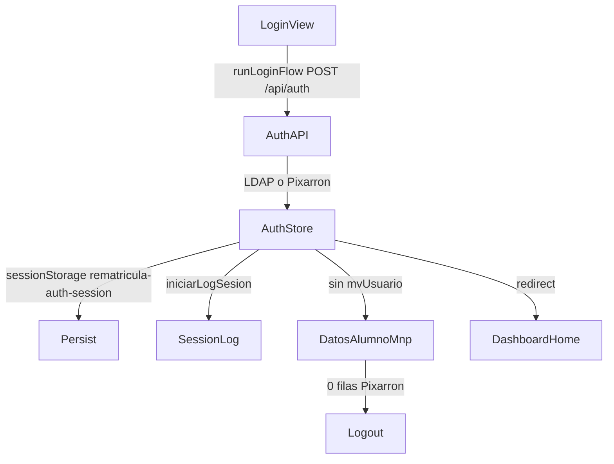
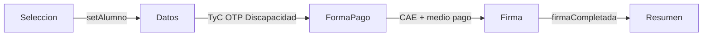
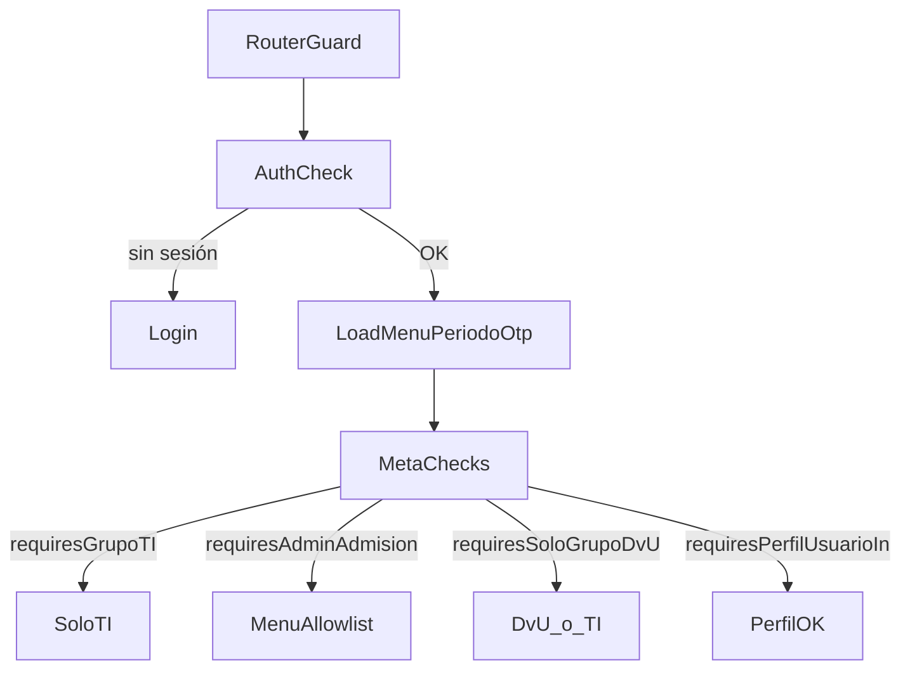

# Componentes y capas — rematricula-online

Documentación orientada a desarrolladores: cada pieza de dominio, su ruta, dependencias y funcionamiento a nivel de código.

---

## 1. Introducción

### Stack

| Capa | Tecnología |
|------|------------|
| Framework | Vue 3.5 (`<script setup>`) + TypeScript |
| Build | Vite 5, `vue-tsc`, Vitest |
| Routing | vue-router 4 (lazy imports) |
| Estado | Pinia 2 (stores auto-import vía `unplugin-auto-import`) |
| UI | shadcn-vue + Tailwind 3 + radix-vue / reka-ui |
| Iconos | lucide-vue-next |
| Tablas | @tanstack/vue-table |
| Rich text | TipTap (`@tiptap/vue-3`) |
| Datos | Supabase JS (cliente principal + cliente simulador) |
| Auth | `@uniacc/autenticacion` + proxy `/api/auth` |
| PDF / Excel | jspdf, jszip, xlsx |

### Organización del código

Híbrido por tipo de archivo (`views` / `components` / `stores` / `services` / `composables`) y por dominio dentro de `views/` (auth, matricula-mock, dashboard/matricula, rematricula, backoffice).

```
src/
├── main.ts, App.vue
├── router/index.ts
├── views/           # Páginas por dominio
├── components/      # Dominio + ui/ (shadcn)
├── composables/
├── stores/
├── services/
├── constants/
├── types/
└── utils/
```

Alias de import: `@/`.

---

## 2. Arquitectura y flujos

### Login / sesión



### Flujo mock rematrícula (alumno)



Estado del flujo: `useMockMatriculaContextStore` (`sessionStorage` key `rematricula-mock-matricula`).

### Permisos / menú dashboard



| Concepto | Valores |
|----------|---------|
| `codigo_grupo` | 1 = DVU, 2 = Admisión, 3 = TI |
| `codigo_perfil_usuario` | 1/2 SuperAdmin/Admin; 1/2/3 en mantenedores DVU |
| Menú | `bo_menu_item` + `bo_menu_item_grupo` → `useDashboardMenuStore` |

---

## 3. Shell y bootstrap

### `App.vue`

- **Ruta:** `src/App.vue`
- **Rol:** Shell raíz de la SPA.
- **Props / emits:** ninguno.
- **Dependencias:** `useErrorStore`, `Toaster` (shadcn), `vue-sonner`.
- **Funcionamiento:**
  - `onErrorCaptured` → `useErrorStore().setError({ error })`.
  - Renderiza `RouterView` con transición `fade` keyed por `route.fullPath`.
  - Toasters globales (shadcn + Sonner top-center).
  - Contenedor `min-h-svh bg-zinc-100`.

### `main.ts`

- **Ruta:** `src/main.ts`
- **Rol:** Bootstrap de la app.
- **Dependencias:** `createPinia`, `useAuthStore`, `useMockContactoOtpUiStore`, `useMockMatriculaContextStore`, `logMockContactoOtp`, `router`.
- **Funcionamiento:**
  1. Crea app + Pinia.
  2. `useMockContactoOtpUiStore().resetAll()`.
  3. `await useAuthStore().hydrateFromStorage()`.
  4. `useMockMatriculaContextStore().hydrateFromSessionStorage()`.
  5. `app.use(router)` y `app.mount('#app')`.

---

## 4. Router y permisos

**Archivo:** [`src/router/index.ts`](../src/router/index.ts)

### Rutas

| Path | Name | Vista | Meta relevante |
|------|------|-------|----------------|
| `/` | `home` | redirect → `/login` | — |
| `/login` | `login` | `LoginView.vue` | — |
| `/dashboard` | `dashboard` | `DashboardView.vue` | redirect `/dashboard/home` |
| `/dashboard/home` | `dashboard-home` | `HomeView.vue` | — |
| `/dashboard/matricula-mock` | — | `MatriculaMockLayout.vue` | redirect selección |
| `…/seleccion-alumno` | `matricula-mock-seleccion-alumno` | `MatriculaMockSeleccionAlumnoView.vue` | — |
| `…/datos-personales` | `matricula-mock-datos` | `DatosPersonalesMockView.vue` | — |
| `…/forma-pago` | `matricula-mock-forma-pago` | `FormaPagoMockView.vue` | — |
| `…/firma` | `matricula-mock-firma` | `FirmaMockView.vue` | — |
| `…/resumen` | `matricula-mock-resumen` | `ResumenMockView.vue` | — |
| `/dashboard/postulantes` | `dashboard-postulantes` | `PostulantesView.vue` | `requiresAdminAdmision` |
| `/dashboard/simulador-uso` | `dashboard-simulador-uso` | `SimuladorUso.vue` | `requiresAdminAdmision` |
| `/dashboard/mantenedor-carreras` | `dashboard-mantenedor-carreras` | `MantenedorCarrerasView.vue` | AdminAdmisión + perfil `[1,2]` |
| `/dashboard/estado-firma-contrato` | `dashboard-estado-firma-contrato` | `EstadoFirmaContratoView.vue` | `requiresAdminAdmision` |
| `/dashboard/matriculados` | `dashboard-matriculados` | `MatriculadosView.vue` | `requiresAdminAdmision` |
| `/dashboard/mantenedor-periodo-activo` | `dashboard-mantenedor-periodo-activo` | `MantenedorPeriodoActivoView.vue` | Admin + SoloDvU + perfil `[1,2,3]` |
| `/dashboard/mantenedor-alumnos-matricular` | `dashboard-mantenedor-alumnos-matricular` | `MantenedorAlumnosMatricularView.vue` | idem |
| `/dashboard/vista-aranceles-erp` | `dashboard-vista-aranceles-erp` | `ArancelesErpView.vue` | idem |
| `/dashboard/vista-beneficios-erp` | `dashboard-vista-beneficios-erp` | `BeneficiosErpView.vue` | idem |
| `/dashboard/vista-estado-cae-alumnos` | `dashboard-vista-estado-cae-alumnos` | `EstadoCaeAlumnosErpView.vue` | idem |
| `/dashboard/vista-cae-arancel-referencia` | `dashboard-vista-cae-arancel-referencia` | `CaeArancelReferenciaErpView.vue` | idem |
| `/dashboard/mantenedor-convenios` | `dashboard-mantenedor-convenios` | `MantenedorConveniosView.vue` | idem |
| `/dashboard/mantenedor-descuento-matricula-anticipada` | `dashboard-mantenedor-descuento-matricula-anticipada` | `MantenedorDescuentoMatriculaAnticipadaView.vue` | idem |
| `/dashboard/mantenedor-terminos-condiciones` | `dashboard-mantenedor-terminos-condiciones` | `MantenedorTerminosCondicionesView.vue` | idem |
| `/dashboard/mantenedor-contacto-otp` | `dashboard-mantenedor-contacto-otp` | `MantenedorContactoOtpView.vue` | idem |
| `/dashboard/backoffice` | — | `BackofficeLayout.vue` | `requiresGrupoTI` |
| `…/menu` | `dashboard-backoffice-menu` | `BoMenuMantenimientoView.vue` | hereda TI |
| `…/usuarios` | `dashboard-backoffice-usuarios` | `BoUsuariosMantenimientoView.vue` | hereda TI |
| `/:pathMatch(.*)*` | `NotFound` | `NotFound.vue` | — |

Nota: `/dashboard/admin/menu` redirige a `/dashboard/backoffice/menu`.

### `beforeEach` (orden)

1. Si path `/dashboard*` sin auth → `login` + `query.redirect`.
2. Con auth: carga paralela `dashboardMenu.ensureLoaded()`, `periodoActivo.ensureLoaded()`, `contactoOtpConfig.ensureLoaded(isMockFlow)`.
3. `requiresGrupoTI` sin TI → `dashboard-home`.
4. `requiresAdminAdmision` → allowlist menú (`allowedRouteNamesFromMenu` / `routeNameAllowedByMenu`); no permitido → home.
5. `requiresSoloGrupoDvU` → solo `codigo_grupo === 1` o TI; else → home.
6. `requiresPerfilUsuarioIn` → `perfil.codigo_perfil_usuario` en el array; else → home.
7. Pixarron con `cantidadRegistros === 0` → toast + logout + login.
8. Ya autenticado en `login` → `dashboard-home`.
9. Flujo mock (datos/forma/firma/resumen) sin alumno → `matricula-mock-seleccion-alumno`.

---

## 5. Auth y layout dashboard

### `LoginView`

- **Ruta:** `src/views/auth/LoginView.vue`
- **Rol:** Pantalla de inicio de sesión LDAP / Pixarron.
- **Dependencias:** `useAuthStore`, `useDatosAlumnoMnpStore`, `runLoginFlow`, `sanitizeUsernameInput`.
- **Funcionamiento:**
  - `onUsernameModelUpdate` sanitiza el usuario.
  - `onSubmit` → `runLoginFlow(username, btoa(password), urlOrigen)`.
  - Éxito → `auth.loginFromFlow` + `alumnoMnp.fetchSiSinMvUsuario`; sin `mvUsuario` exige filas MNP o logout.
  - Navega a `route.query.redirect` o `/dashboard/home`.
  - Modal TyC rechazado vía `query.tycRechazado`.

### `DashboardView`

- **Ruta:** `src/views/dashboard/layout/DashboardView.vue`
- **Rol:** Shell del dashboard (sidebar + header + footer).
- **Dependencias:** `useAuthStore`, `useAppStore`, `usePeriodoActivoStore`, `useSessionCloseBeacon`, `DashboardSidebarNav`.
- **Funcionamiento:**
  - Si path incluye `/matricula-mock` → solo `RouterView` (full-bleed, sin sidebar).
  - Si no: `SidebarProvider` + sidebar + cabecera (nombre, periodo, appName) + footer.
  - `logout()` → `auth.logout()` + `router.replace({ name: 'login' })`.
  - Beacon de cierre de sesión activo.

### `DashboardSidebarNav`

- **Ruta:** `src/views/dashboard/layout/DashboardSidebarNav.vue`
- **Rol:** Navegación lateral dinámida desde menú BD.
- **Dependencias:** `useAuthStore`, `useDashboardMenuStore`, `useSidebar`, `buildDashboardMenuPlan`, `esLinkActivoDashboard`.
- **Funcionamiento:**
  - `navPlan` computado con ítems BD + `codigo_grupo` + `authSource`.
  - Links top + grupos collapsible; en sidebar colapsado, subgrupos en `DropdownMenu`.
  - `reintentarMenu` → `menuStore.refetch()`.
  - Alert si menú vacío o `loadError`.

### `DashboardLogo`

- **Ruta:** `src/views/dashboard/layout/DashboardLogo.vue`
- **Rol:** Marca en sidebar.
- **Dependencias:** `useAppStore`.
- **Funcionamiento:** Muestra `appStore.appName`; `RouterLink` a `/dashboard`.

### `buildDashboardMenu.ts`

- **Ruta:** `src/views/dashboard/layout/buildDashboardMenu.ts`
- **Exports:** `buildDashboardMenuPlan`, `allowedRouteNamesFromMenu`, `routeNameAllowedByMenu`, `esLinkActivoDashboard`, tipos `DashboardNav*Resolved`.
- **Funcionamiento:**
  - Filtra ítems por `activo` + filas grupo (grupo 3 = TI ve todo).
  - Pixarron sin grupo → plan fijo Inicio + Mock matrícula.
  - Arma árbol raíces link/group hasta 2 niveles.
  - Si mock está en menú, añade rutas hijas mock al set permitido.

### `dashboardNav.ts`

- **Ruta:** `src/views/dashboard/layout/dashboardNav.ts`
- **Rol:** Deprecated; reexporta de `buildDashboardMenu.ts` para compatibilidad.

### `HomeView`

- **Ruta:** `src/views/dashboard/home/HomeView.vue`
- **Rol:** Home post-login.
- **Dependencias:** `useAppStore`, `useAuthStore`.
- **Funcionamiento:** Saludo con nombre; CTA a `matricula-mock-seleccion-alumno`; cards estáticas de resumen/sesión/ayuda.

### `NotFound`

- **Ruta:** `src/views/errors/NotFound.vue`
- **Rol:** 404 catch-all.
- **Funcionamiento:** `volverAlInicio` → `router.push({ name: 'dashboard-home' })`.

---

## 6. Matrícula mock (flujo alumno)

### `MatriculaMockLayout`

- **Ruta:** `src/views/matricula-mock/MatriculaMockLayout.vue`
- **Rol:** Layout del flujo de 4 pasos con stepper.
- **Dependencias:** `useAuthStore`, `useMockMatriculaContextStore`, `usePeriodoActivoStore`, `useMockAlumnoFuente`.
- **Funcionamiento:**
  - Stepper bound a ruta vía `stepModel` (`STEP_NAMES`).
  - Header sticky compacto por scroll.
  - Datos alumno desde `useMockAlumnoFuente`.
  - `cambiarAlumnoPrueba` → `mockCtx.clearAlumno()` + selección.
  - `salirAlDashboard` / `anularSimulacion` → `dashboard-home`.
  - `RouterView` con fade.

### `MatriculaMockSeleccionAlumnoView`

- **Ruta:** `src/views/matricula-mock/MatriculaMockSeleccionAlumnoView.vue`
- **Rol:** Paso 0 — elegir alumno de prueba.
- **Dependencias:** `useMockMatriculaContextStore`, `usePeriodoActivoStore`, `fetchPlanPagosMv`.
- **Funcionamiento:**
  - `onMounted` → `cargarDatos()` (plan pagos del periodo activo).
  - Filtros locales RUT/nombre/codcli.
  - `probarFlujo(row)` → `mockCtx.setAlumno(row)` + push `matricula-mock-datos`.

### `DatosPersonalesMockView`

- **Ruta:** `src/views/matricula-mock/DatosPersonalesMockView.vue`
- **Rol:** Paso 1 — TyC, OTP de contacto, discapacidad.
- **Dependencias:** auth, `contactoOtpConfig`, `datosAlumnoMnp`, `mockMatriculaContext`, `mockContactoOtpUi`, periodo, `useMockAlumnoFuente`, `registrarLogContactoOtp`, `contextoMolAuditoria`; hijos TyC y Discapacidad.
- **Funcionamiento:**
  - Subpasos locales: `tyc` | `contacto` | `discapacidad` (inicia según `tycAccepted`).
  - `onMounted`: reset OTP UI, `otpConfig.ensureLoaded(true)`, periodo.
  - OTP mock (`MOCK_OTP_CODE = '123456'`): enviar/confirmar correo y SMS; opción continuar sin OTP.
  - Auditoría vía `registrarLogContactoOtp`.
  - Al validar contactos → discapacidad.

### `MatriculaMockTyCStep`

- **Ruta:** `src/views/matricula-mock/MatriculaMockTyCStep.vue`
- **Emits:** `aceptado`
- **Dependencias:** auth, mock context, `terminosCondiciones`, periodo, `useMockAlumnoFuente`, `registrarLogTyCRespuesta`, `RichTextContent`.
- **Funcionamiento:**
  - `onMounted` → `tycStore.ensureLoaded`.
  - `aceptar` → audit `acepta` + `mockCtx.acceptTyc()` + emit `aceptado`.
  - Rechazo → audit `rechaza`, `rejectTyc`, `clearAlumno`, `auth.logout`, login `?tycRechazado=1`.

### `MatriculaMockDiscapacidadStep`

- **Ruta:** `src/views/matricula-mock/MatriculaMockDiscapacidadStep.vue`
- **Dependencias:** mock context, periodo, `useMockAlumnoFuente`, `guardarDiscapacidadEncuesta`.
- **Funcionamiento:** Contestar/omitir; `guardar` / `omitir` → RPC + `mockCtx.setDiscapacidad` → navega a forma de pago.

### `FormaPagoMockView`

- **Ruta:** `src/views/matricula-mock/FormaPagoMockView.vue`
- **Dependencias:** mock context, periodo, `useMockAlumnoFuente`, `ejecutarVerificacionCae`, `MatriculaMockVerificacionCaeStep`.
- **Funcionamiento:**
  - Subpasos: `verificacion-cae` | `becas` | `pago`.
  - `correrVerificacionCae` → `mockCtx.setVerificacionCae`; si `continua` → becas.
  - `simularPago(medio)` (`webpay` | `pagare` | `toku`) → `setFormaPago` + firma.

### `MatriculaMockVerificacionCaeStep`

- **Ruta:** `src/views/matricula-mock/MatriculaMockVerificacionCaeStep.vue`
- **Props:** `estado: 'verificando'|'pendiente'`, `reintentando?`, `periodoLabel?`, `nombreAlumno?`, `codcli?`
- **Emits:** `reintentar`, `volver`
- **Funcionamiento:** UI presentacional; la lógica vive en el padre.

### `FirmaMockView`

- **Ruta:** `src/views/matricula-mock/FirmaMockView.vue`
- **Dependencias:** mock context, `useMockAlumnoFuente`.
- **Funcionamiento:** FES mock (serie cédula + OTP `112233`); `firmarContrato` → `setFirmaCompletada(true)` + resumen.

### `ResumenMockView`

- **Ruta:** `src/views/matricula-mock/ResumenMockView.vue`
- **Dependencias:** mock context, `useMockAlumnoFuente`, `fmtMontoClp`.
- **Funcionamiento:** Resumen de montos/forma pago/discapacidad; toasts de descarga mock; Anterior → firma; Volver inicio → home. No limpia el store.

---

## 7. Componentes de dominio compartidos

### Errores y estados vacíos

#### `AppErrorPage`

- **Ruta:** `src/components/AppErrorPage.vue`
- **Dependencias:** `useErrorStore`.
- **Funcionamiento:** Lee `activeError` y deriva message/code/details/hint/statusCode; carga `AppErrorDevSection` (prod comentado).

#### `AppErrorDevSection`

- **Ruta:** `src/components/AppErrorDevSection.vue`
- **Props:** `message`, `customCode`, `code`, `statusCode`, `hint`, `details`
- **Funcionamiento:** Detalle técnico + link a dashboard.

#### `AppErrorProdSection`

- **Ruta:** `src/components/AppErrorProdSection.vue`
- **Props:** `message`, `customCode`, `statusCode`, `isCustomError`
- **Funcionamiento:** Mensaje genérico; status 406 → mensaje tipo 404.

#### `InfoMensajeSinData`

- **Ruta:** `src/components/InfoMensajeSinData.vue`
- **Props:** `icono: 'mantencion'|'vacio'`, `mensaje: string`
- **Funcionamiento:** Empty state con icono Lucide.

#### `ModalCargandoDatos`

- **Ruta:** `src/components/ModalCargandoDatos.vue`
- **Props:** `open`, `añoAnterior?`, `añoNuevo?`, `estadoAlumnos?|estadoCursos?|estadoVistas?: 'pendiente'|'cargando'|'completado'`
- **Funcionamiento:** Modal bloqueante (sin escape/outside) con etapas de sync.

### Postulantes

#### `PostulantesFiltros`

- **Ruta:** `src/components/Postulantes/PostulantesFiltros.vue`
- **Props:** `filtros: FiltrosPostulante`, `carreras?`
- **Emits:** `update`, `limpiar`, `buscar`

#### `PostulantesStats`

- **Ruta:** `src/components/Postulantes/PostulantesStats.vue`
- **Props:** `stats: PostulanteStats|null`, `isLoading?`
- **Funcionamiento:** Cards de métricas con accordions de detalle.

#### `PostulanteDetalle`

- **Ruta:** `src/components/Postulantes/PostulanteDetalle.vue`
- **Props:** `open`, `postulante`, `isLoading?`
- **Emits:** `update:open`, `desistimiento-actualizado`
- **Dependencias:** `useDesistimiento`, timeline + historial.
- **Funcionamiento:** Watch open → historial; `toggleDesistido` / `cambiarEstadoSeguimiento`.

#### `EstadoPostulacionTimeline`

- **Ruta:** `src/components/Postulantes/EstadoPostulacionTimeline.vue`
- **Props:** `estadoActual`, `esAlumnoVigente?`, `esDesistido?`
- **Funcionamiento:** Pasos visibles según estados U/E/A/M/R/desistido.

#### `HistorialEstadosSeguimiento`

- **Ruta:** `src/components/Postulantes/HistorialEstadosSeguimiento.vue`
- **Props:** `historial`, `isLoading?`, `variant?: 'compact-list'|'compact-timeline'|'badges'|'table'`

### Prospectos

#### `ProspectoDetalle`

- **Ruta:** `src/components/Prospectos/ProspectoDetalle.vue`
- **Props:** `open`, `prospectos?`, `isLoading?`
- **Emits:** `update:open`
- **Dependencias:** `useProspectos` (`fetchCarreraPorId`, `fetchBecaPorId`).
- **Funcionamiento:** Al abrir carga carrera/beca por simulación; accordion de solo lectura.

### Rematrícula

#### `PlanPagosAlumnoDetalleDialog`

- **Ruta:** `src/components/rematricula/PlanPagosAlumnoDetalleDialog.vue`
- **Props:** `open`, `row: PlanPagosMvRow|null`
- **Emits:** `update:open`
- **Funcionamiento:** Diálogo de detalle de plan (montos, beneficios, apoderado).

#### `SimuladorPlanPagoDialog`

- **Ruta:** `src/components/rematricula/SimuladorPlanPagoDialog.vue`
- **Dependencias:** `useSimuladorPlanPagoStore`, auth, `tipoPago`, `convenio`, PDF preview/download.
- **Funcionamiento:** Controlado por store (`open` / `cerrar`); `patchForm`, `guardar`, recalcular al abrir; PDFs borrador/oficial.
- **Nota:** Hoy no tiene consumer cableado desde una vista.

### Rich text

#### `RichTextContent`

- **Ruta:** `src/components/rich-text/RichTextContent.vue`
- **Props:** `html` (default `''`), `class?`
- **Funcionamiento:** `sanitizeRichTextHtml` + `v-html`.

#### `RichTextEditor`

- **Ruta:** `src/components/rich-text/RichTextEditor.vue`
- **Model:** `defineModel<string>` (HTML)
- **Dependencias:** TipTap (`StarterKit`, `Link`).
- **Funcionamiento:** Toolbar bold/italic/H2/H3/listas/link; destroy on unmount; sync externo con watch.

---

## 8. Vistas dashboard — Admisión

### `PostulantesView`

- **Ruta:** `src/views/dashboard/matricula/PostulantesView.vue`
- **Dependencias:** `usePostulantesStore`, `useAutoRefresh`, componentes Postulantes*.
- **Funcionamiento:** `onMounted` carga stats + postulantes; filtros, paginación, detalle, export, refresh, desistimiento.

### `SimuladorUso`

- **Ruta:** `src/views/dashboard/matricula/SimuladorUso.vue`
- **Dependencias:** `useProspectos`, `ProspectoDetalle`.
- **Funcionamiento:** Lista paginada de prospectos; filtros consentimiento/búsqueda; auto-refresh horario; detalle por RUT; export CSV.

### `MantenedorCarrerasView`

- **Ruta:** `src/views/dashboard/matricula/MantenedorCarrerasView.vue`
- **Dependencias:** `useCarrerasUniacc`.
- **Funcionamiento:** CRUD carreras; filtros búsqueda/facultad/nivel/modalidad; persiste en Supabase simulador.

### `MatriculadosView`

- **Ruta:** `src/views/dashboard/rematricula/MatriculadosView.vue`
- **Dependencias:** `useMatriculados`, `useAutoRefresh`.
- **Funcionamiento:** Filtros RUT/tipo, paginación, detalle acordeón, export, sync background.

### `EstadoFirmaContratoView`

- **Ruta:** `src/views/dashboard/rematricula/EstadoFirmaContratoView.vue`
- **Dependencias:** `useFirmaAcepta`, `useAutoRefresh`, `admisionApiBaseUrl`.
- **Funcionamiento:** Filtros firma faltante; abre PDF firmado vía API; sheets resumen; export CSV.

---

## 9. Vistas dashboard — Rematrícula / mantenedores

### Patrón vistas ERP

`ArancelesErpView`, `BeneficiosErpView`, `EstadoCaeAlumnosErpView`, `CaeArancelReferenciaErpView`:

- Cada una usa su store (`useArancelesErpStore`, etc.).
- Handlers: `cargarDatos()`, `actualizarDesdeErp()` (+ toast), filtros search del store.
- `onMounted` → cargar.
- `CaeArancelReferenciaErpView` añade `rowKey`, clases de arancel y expansión de filas.

| Vista | Store | Sync service |
|-------|-------|--------------|
| `ArancelesErpView.vue` | `useArancelesErpStore` | `syncArancelesFromErp` |
| `BeneficiosErpView.vue` | `useBeneficiosErpStore` | `syncBeneficiosFromErp` |
| `EstadoCaeAlumnosErpView.vue` | `useEstadoCaeAlumnosErpStore` | `syncEstadoCaeAlumnosFromErp` |
| `CaeArancelReferenciaErpView.vue` | `useCaeArancelReferenciaErpStore` | `syncCaeArancelReferenciaFromErp` |

### `MantenedorAlumnosMatricularView`

- **Ruta:** `src/views/dashboard/rematricula/MantenedorAlumnosMatricularView.vue`
- **Dependencias:** periodo, `fetchPlanPagosMv`, `syncAlumnosPeriodoFromErp`, `PlanPagosAlumnoDetalleDialog`.
- **Funcionamiento:** Tabla filtrable; sync ERP; detalle dialog; aviso de datos desactualizados vs periodo.

### `MantenedorPeriodoActivoView`

- **Dependencias:** `usePeriodoActivoStore`.
- **Funcionamiento:** Lista periodos; `confirmarActivacion` → `store.activar`.

### `MantenedorConveniosView`

- **Dependencias:** `useConvenioInstitucionalStore`, periodo.
- **Funcionamiento:** CRUD + import Excel (`runImport`, `onImportFileChange`).

### `MantenedorDescuentoMatriculaAnticipadaView`

- **Dependencias:** `useDescuentoMatriculaAnticipadaStore`, periodo.
- **Funcionamiento:** CRUD (`openCreate` / `openEdit` / `saveForm` / `confirmDelete`).

### `MantenedorTerminosCondicionesView`

- **Dependencias:** `useTerminosCondicionesStore`, `RichTextEditor`, `RichTextContent`.
- **Funcionamiento:** Drafts título/HTML; confirmación de guardado; preview.

### `MantenedorContactoOtpView`

- **Dependencias:** `useContactoOtpConfigStore`.
- **Funcionamiento:** Drafts validez/reintento; `confirmarGuardar` / `recargar`.

---

## 10. Backoffice TI

### `BackofficeLayout`

- **Ruta:** `src/views/dashboard/backoffice/BackofficeLayout.vue`
- **Funcionamiento:** Solo `<RouterView />` (guard TI en router).

### `BoMenuMantenimientoView`

- **Dependencias:** `useDashboardMenuStore`, `supabase`.
- **Funcionamiento:** CRUD ítems menú; `persistGrupos` DVU/Admisión; rutas desde `DASHBOARD_MENU_ROUTE_NAMES`.

### `BoUsuariosMantenimientoView`

- **Dependencias:** `supabase` (`mv_usuario`).
- **Funcionamiento:** `load` onMounted; upsert perfiles/grupos; no edita LDAP en pantalla.

---

## 11. Stores Pinia

| Store | State clave | Persistencia | Consumidores típicos |
|-------|-------------|--------------|----------------------|
| `useAuthStore` | username, email, perfil, authSource, mvUsuario, sessionLogId | `sessionStorage` `rematricula-auth-session` | router, login, layout, mock, beacon |
| `useAppStore` | appName, isLoading | — | layout, home, logo |
| `useErrorStore` | activeError, isCustomError | — | App, AppErrorPage, composables |
| `useDashboardMenuStore` | items, grupoRows, loadError, fetched | — | router, sidebar, BO menú |
| `usePeriodoActivoStore` | rows, vigente, label/titulo | — | router, mantenedores, mock |
| `useDatosAlumnoMnpStore` | filas MNP | — | login, router Pixarron, fuente alumno |
| `useMockMatriculaContextStore` | alumno, TyC, discapacidad, CAE, pago, firma | `sessionStorage` `rematricula-mock-matricula` | flujo mock + guard |
| `useMockContactoOtpUiStore` | máquina UI OTP | — | DatosPersonalesMock, logout |
| `useContactoOtpConfigStore` | config tiempos OTP | — | router, mantenedor OTP, mock |
| `useTerminosCondicionesStore` | documento TyC | — | mantenedor TyC, TyC step |
| `usePostulantesStore` | listado, stats, filtros | — | PostulantesView |
| `useConvenioInstitucionalStore` | CRUD + import | — | MantenedorConvenios |
| `useDescuentoMatriculaAnticipadaStore` | CRUD | — | Mantenedor descuento |
| `useTipoPagoStore` | catálogo `tp_tipo_pago` | — | simulador |
| `useConvenioStore` | `tp_convenio` / fallback | — | simulador |
| `useSimuladorPlanPagoStore` | form, resultado, dialog | — | SimuladorPlanPagoDialog |
| `useArancelesErpStore` | rows + sync | — | ArancelesErpView |
| `useBeneficiosErpStore` | rows + sync | — | BeneficiosErpView |
| `useEstadoCaeAlumnosErpStore` | rows + sync | — | EstadoCaeAlumnosErpView |
| `useCaeArancelReferenciaErpStore` | rows + sync | — | CaeArancelReferenciaErpView |

Acciones relevantes de auth: `loginFromFlow`, `logout`, `hydrateFromStorage`, getters `isAuthenticated`, `displayNombreCompleto`, `esGrupoTI`.

---

## 12. Composables

| Export | Archivo | Función | APIs |
|--------|---------|---------|------|
| `useMockAlumnoFuente` | `useMockAlumnoFuente.ts` | Unifica display alumno (plan MV > MNP > LDAP) | stores |
| `useSessionCloseBeacon` | `useSessionCloseBeacon.ts` | Beacon cierre en `pagehide` | `/api/auth/cerrar-sesion` |
| `useCarrerasUniacc` | `useCarrerasUniacc.ts` | CRUD carreras | Supabase simulador `carreras_uniacc` |
| `useDesistimiento` | `useDesistimiento.ts` | Desistido + historial seguimiento | RPC `uniacc_*`, `mv_historial_estados_seguimiento` |
| `usePostulantes` | `usePostulantes.ts` | Lista/detalle/stats/export | `/api/postulantes*` |
| `useMatriculados` | `useMatriculados.ts` | Lista, stats, sync, CSV | `/api/matriculados*` |
| `useFirmaAcepta` | `useFirmaAcepta.ts` | Estado firma + sync | `/api/firma-acepta*` |
| `useProspectos` | `useProspectos.ts` | Prospectos + carrera/beca | tablas simulador |
| `useAutoRefresh` | `useAutoRefresh.ts` | Countdown Lun–Sáb 07–23 | — |
| `cn`, `valueUpdater`, `sanitizeUsernameInput` | `utils.ts` | Helpers UI / login | — |

---

## 13. Services

| Archivo | Export principal | Destino | Propósito |
|---------|------------------|---------|-----------|
| `supabaseClient.ts` | `supabase` | Supabase principal | BD rematrícula |
| `supabaseSimuladorClient.ts` | `supabaseSimuladorClient` | 2º proyecto | Simulador/prospectos |
| `auth.ts` | `runLoginFlow` | `POST /api/auth` | Login LDAP/Pixarron |
| `sessionLog.ts` | `iniciarLogSesion` / `cerrarLogSesion` / beacon | RPC log sesión; `/api/auth/cerrar-sesion` | Auditoría sesión |
| `periodoActivo.ts` | `fetchPeriodos*`, `activarPeriodo` | `tp_periodo_activo`, RPC activar | Periodo vigente |
| `contactoOtpConfig.ts` | `fetch/updateContactoOtpConfig` | `tp_contacto_otp_config` | Tiempos OTP |
| `rematriculaOtpApi.ts` | `solicitar/verificarOtpEmailCorreoPersonal` | `/api/rematricula/contacto-otp/email/*` | OTP correo |
| `contactoOtpAuditLog.ts` | `registrarLogContactoOtp` | RPC `registrar_log_mol_contacto_otp` | Log OTP |
| `terminosCondiciones.ts` | `fetch/updateTerminosMol` | `tp_terminos_condiciones` | TyC MOL |
| `tycAuditLog.ts` | `registrarLogTyCRespuesta` | RPC `registrar_log_mol_tyc_respuesta` | Log TyC |
| `discapacidadEncuesta.ts` | `guardarDiscapacidadEncuesta` | RPC `guardar_mnp_discapacidad_encuesta` | Encuesta |
| `verificacionCae.ts` | `ejecutarVerificacionCae` | RPC `ejecutar_verificacion_cae_mol` | Gate CAE |
| `molAuditContext.ts` | `contextoMolAuditoria` | auth store | Payload auditoría común |
| `fetchPlanPagosMv.ts` | `fetchPlanPagosMv` | view `v_mnp_mv_plan_pagos` | Alumnos / mock |
| `alumnosPeriodoSyncApi.ts` | `syncAlumnosPeriodoFromErp` | `…/alumnos-periodo/sync` | Sync alumnos |
| `fetchMtArancel.ts` | `fetchMtArancel` | `mnp_mt_arancel` | Lectura aranceles |
| `arancelesSyncApi.ts` | `syncArancelesFromErp` | `…/aranceles/sync` | Sync aranceles |
| `fetchMtBeneficio.ts` | `fetchMtBeneficio` | `mnp_mt_beneficio` | Lectura beneficios |
| `beneficiosSyncApi.ts` | `syncBeneficiosFromErp` | `…/beneficios/sync` | Sync beneficios |
| `fetchMnpEstadoCaeAlumnos.ts` | `fetchMnpEstadoCaeAlumnos` | `mnp_estado_cae_alumnos` | CAE por alumno |
| `estadoCaeAlumnosSyncApi.ts` | `syncEstadoCaeAlumnosFromErp` | `…/estado-cae-alumnos/sync` | Sync CAE |
| `fetchTpMnpCaeArancelReferencia.ts` | `fetchTpMnpCaeArancelReferencia` | `tp_mnp_cae_arancel_referencia` | Arancel ref. CAE |
| `caeArancelReferenciaSyncApi.ts` | `syncCaeArancelReferenciaFromErp` | `…/cae-arancel-referencia/sync` | Sync arancel CAE |
| `convenioInstitucional.ts` | CRUD/import | `tp_mnp_convenio*` | Mantenedor convenios |
| `parseConveniosExcel.ts` | `parseConveniosExcel` | xlsx local | Parse import |
| `descuentoMatriculaAnticipada.ts` | CRUD | `tp_mnp_descuento_matricula_anticipada` | Descuento anticipada |
| `simuladorPlanPago.ts` | catálogos, calc, guardar | `tp_tipo_pago`, convenios, `mnp_simulacion_plan_pago*` | Simulador plan |
| `planPagoPdfBatch.ts` | download/preview PDF/ZIP | utils PDF + simulador | PDFs masivos |

---

## 14. UI shadcn (`src/components/ui/`)

Primitives generadas (~176 SFC). Cada familia suele exportar por `index.ts` y se auto-importa.

| Familia | Rol típico |
|---------|------------|
| `accordion` | Secciones colapsables |
| `alert` / `alert-dialog` | Avisos y confirmaciones |
| `aspect-ratio` | Contenedor con ratio fijo |
| `avatar` | Avatar de usuario |
| `badge` | Etiquetas de estado |
| `button` | Botones (variantes CVA) |
| `calendar` | Selector de fechas |
| `card` | Contenedor de contenido |
| `checkbox` | Checkbox |
| `command` | Palette / command menu |
| `datatable` | Tabla TanStack (`data-table.vue`, dropdown) |
| `dialog` | Modales |
| `dropdown-menu` | Menús contextuales |
| `hover-card` | Card al hover |
| `input` / `label` / `textarea` | Formularios |
| `navigation-menu` | Nav horizontal |
| `popover` | Popover anclado |
| `progress` | Barra de progreso |
| `radio-group` | Radios |
| `scroll-area` | Scroll custom |
| `select` | Select |
| `separator` | Separador visual |
| `sheet` | Panel lateral |
| `sidebar` | Sidebar app + `useSidebar` / `provideSidebarContext` |
| `skeleton` | Loading placeholders |
| `sonner` | Toasts Sonner |
| `stepper` | Pasos (flujo mock) |
| `switch` | Toggle |
| `table` | Tabla básica |
| `tabs` | Pestañas |
| `toast` + `use-toast.ts` | Toasts shadcn |
| `tooltip` | Tooltips |

No hay `provide/inject` de dominio de negocio fuera del contexto de sidebar.

---

## 15. Notas útiles

- El `package.json` mantiene el name `dashboard-template`; el título de UI viene de `useAppStore().appName` («Sitio Matricula Online»).
- `dashboard-mantenedor-contacto-otp` está en el router pero puede no figurar en `DASHBOARD_MENU_ROUTE_NAMES` (el acceso depende del menú BD / meta SoloDvU).
- `SimuladorPlanPagoDialog.vue` está implementado pero sin import desde views.
- `ModalCargandoDatos.vue` e `InfoMensajeSinData.vue` existen como utilidades de UI de dominio.
- Backend efectivo: Supabase local (`mnp_*`, `tp_*`, `mv_*`, `log_mol_*`, `bo_menu_*`) + `uniacc-api` + auth centralizada + sync ERP vía `/api/rematricula/.../sync`.
- Códigos OTP mock del flujo alumno: correo/SMS `123456`; firma institucional `112233`.
- Persistencia crítica de sesión: `rematricula-auth-session` y `rematricula-mock-matricula` en `sessionStorage`, hidratadas en `main.ts` antes del mount.
`)