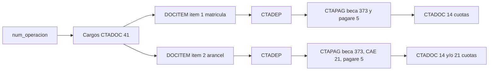
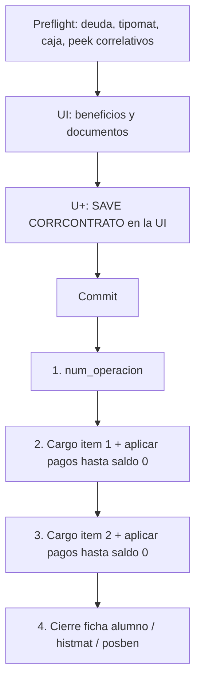
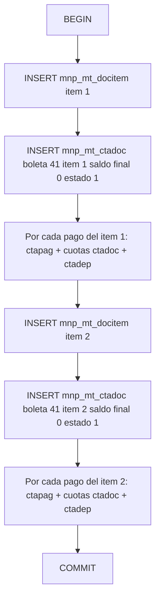
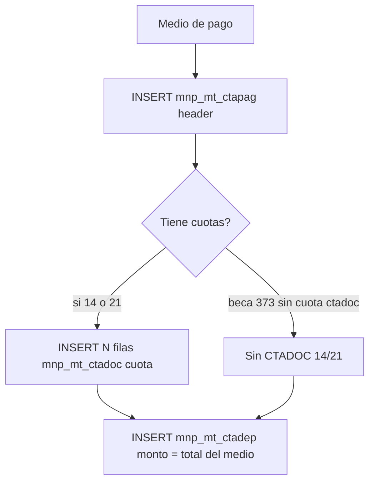

# Cómo funciona la matrícula y cómo escribir las tablas

Modelo de grabación observado en caja U+ (SQL Server) y receta para el staging MOL (Postgres). SPs de correlativos y preflight: [`Analisis_SP.md`](Analisis_SP.md). Tablas staging: migración `20260818120000_mnp_mt_docitem_ctadoc_ctapag_ctadep.sql`.

**Fuente de paridad:** Profiler `TEST_UNIACC.db_owner.TRACE_CAE_17562199` (15-jul-2026, caja `wf_mt_caja_test.aspx`). Alumno `17562199`, carrera `IIMU2AE`, periodo `2026/2`, `num_operacion` `960249`. Happy path con CAE.

Staging **no** hace `EXEC` de correlativos ni `INSERT` en SQL Server. Espeja el resultado final. El loop RPC-a-RPC de caja (auditoría + `ForceUpdate` por cuota) no se replica.

**`usuario`:** operador UMAS de la caja abierta (`MT_PARCAJA.USUARIO`). En este ambiente `'27904'`. No usar `mol` ahí. **`origen`:** `'mol'` (procedencia de la fila).

---

## 1. Modelo mental

Una matrícula es **una operación** (`num_operacion`) que deja:

1. **Cargos** — lo que el alumno debe (matrícula e ítem arancel).
2. **Documentos de pago** — con qué se cubre (beca, CAE, pagaré, etc.).
3. **Aplicaciones** — cruce cargo ↔ pago (cuánto de cada pago se imputa a cada cargo).
4. **Cuotas** — desglose de un pagaré (o CAE) en vencimientos.



El **CAE no es un flujo aparte**. Es un beneficio (`CODBEN=4`) cuya forma de pago generada es `CTAPAG=21`. Se aplica al saldo del arancel igual que una beca o un pagaré.

| Rol | Tabla UMAS | Staging MOL | Qué guarda |
| --- | --- | --- | --- |
| Ítem de cargo | `MT_DOCITEM` | `mnp_mt_docitem` | Ítem 1 matrícula, ítem 2 arancel |
| Documento / cuota | `MT_CTADOC` | `mnp_mt_ctadoc` | Boleta 41 **y** cuotas 14/21 |
| Documento de pago | `MT_CTAPAG` | `mnp_mt_ctapag` | Header del medio de pago |
| Cruce cargo-pago | `MT_CTADEP` | `mnp_mt_ctadep` | Una fila por par (boleta, folio de pago) |

No hay FK entre las 4 tablas staging: se pueden insertar en transacción Postgres en el orden de esta guía.

---

## 2. Catálogo de tipos (este flujo)

`MT_DOCUM` y `MT_DOCPAG` no coinciden en todos los códigos. En grab de matrícula mandan los valores que U+ **escribe**, no el nombre del otro catálogo.

| Código | Rol en el grab | Tabla donde vive |
| --- | --- | --- |
| **41** | Boleta electrónica exenta (cargo) | `CTADOC` + `DOCITEM` |
| **5** | Pagaré del alumno (header de pago) | `CTAPAG` |
| **14** | Cuota hija del pagaré 5 | `CTADOC` |
| **21** | Pagaré CAE (header) y cuota CAE | `CTAPAG` y `CTADOC` |
| **373** | Becas internas asignadas (header de pago) | `CTAPAG` |

Beneficios vistos en el trace (ya venían en `MT_POSBEN`; caja actualiza monto y estado):

| `CODBEN` | Nombre | Aplica a | `FPAGOGENERADA` |
| --- | --- | --- | --- |
| 1665 | Anticipación de matrícula antiguos | M, monto fijo | 373 |
| 1811 | Apoyo UNIACC no renovable | A, % | 373 |
| 4 | Crédito Aval del Estado | A, monto fijo | 21 |

Orden de aplicación al saldo: **becas internas → CAE → pagaré alumno**. No al revés: el pagaré cubre el residual.

---

## 3. Estados que hay que dejar al cerrar

Valores observados cuando la matrícula queda OK (saldos en 0).

| Entidad | Campo | Al insertar cargo | Al quedar cubierto |
| --- | --- | --- | --- |
| Boleta 41 | `estado` | `2` (con saldo) | `1` + `feccancel` = fecha caja |
| Boleta 41 | `saldo` | = `monto` | `0` |
| Boleta 41 | `recibido` / `facturable` | `S` / `S` | sin cambio |
| `CTAPAG` 373/5/21 | `recibido` | `N` | `N` |
| `CTAPAG` 1 cuota al día | `estado` | `1` | `1` |
| `CTAPAG` N cuotas | `estado` | `2` mientras se arma | `1` al aplicar la última |
| Cuota 14/21 | `estado` | `2`, `saldo` = `monto` | se deja en `2` (la cuota misma no se “paga” en este grab) |
| `CTADEP` | `estado` | `'1'` (varchar) | `'1'` |
| `DOCITEM` | `estado` | `1` | `1` |

Fecha de caja (`feccom`, `fecreg`, `fecha`, `feccancel` de la boleta) **puede ser distinta** al `fecmod` del servidor. En el trace: caja `2026-07-14`, grab `2026-07-15`. Usar la fecha de caja abierta (`MT_PARCAJA`) para esos campos.

`fecdeuda` / `fecrep` (ctadoc) y, en el header `ctapag` tipo 5, `feccancel` / `fecreg` / `fecha` / `fecven`: día civil Chile (`America/Santiago`) a las 00:00:00 (fecha de inserción), no la fecha de caja.

En las 4 tablas `codcli` es el **RUT cuerpo (sin DV)**, no el código académico. El código de matrícula UMAS va en `contrato`. `usuario` = `'27904'`. `caja` = caja abierta.

`codban` va en `0` (forma parte de las PK de `ctadoc` / `ctapag` / `ctadep`).

---

## 4. Flujo de la operación (U+ vs MOL)



En **MOL staging** el paso 4 no vive en estas 4 tablas. Hoy el preflight solo hace peek de correlativos (no `SAVE`). Decisión abierta: reservar contrato al entrar a forma de pago (paridad U+) o al confirmar (evita agujeros si abandona).

Fuera de staging, U+ además escribe (no bajar a `mnp_mt_*` todavía):

- `sp_insert_control_matricula` … `PENDIENTE` → `sp_update_control_matricula` `OK`
- `pa08_mt_posben_ac`: `ESTADO` 5 (asignado en UI) → 4 + `num_operacion` + `FECASIG`
- `pa08_mt_alumno_ac`: `MATRICULADO=S`, `MATRICULABLE=N`, `ANO_MAT` / `PERIODO_MAT`, `ESTFINAN=AL DIA`
- `INSERT_MT_HISTMAT`
- `pa08_mt_audita_net_in` y `pa08_tg_tablas_controlcambios_in` (no replicar)

---

## 5. Orden de escritura en staging

Una transacción Postgres por `num_operacion`. Insertar **estado final** (no el histórico de rebajas).



### 5.1 Un cargo (ítem)

Campos mínimos alineados al trace. Nombres en minúscula = columnas staging.

**`mnp_mt_docitem`**

| Columna | Ítem 1 (matrícula) | Ítem 2 (arancel) |
| --- | --- | --- |
| `item` | `1` | `2` |
| `ctadoc` | `41` | `41` |
| `ctadocnum` = `ctatrans` | correlativo `SECUENCIA` del cargo | otro `SECUENCIA` |
| `keydocitem` | identity Postgres (U+ usaba `SECUENCIADOCITEM`) | igual |
| `ano` / `periodo` | periodo a matricular | igual |
| `codcli` / `codcarr` / `sede` | RUT sin DV / carrera / sede | igual |
| `tipocarr` | `1` | `1` |
| `cantidad` | `1` | `1` |
| `precio` = `monto` | arancel matrícula | arancel periodo |
| `feccom` | fecha caja | fecha caja |
| `usuario` | `'27904'` | igual |
| `estado` | `1` | `1` |
| `num_operacion` | el de esta matrícula | igual |
| `origen` | `mol` | `mol` |

**`mnp_mt_ctadoc` de la boleta (el cargo)**

Misma `ctadoc=41` + `ctadocnum` que el docitem. `item` = 1 o 2. `contrato` = string `ANOADMISION+PERIODOADMISION+CODCARR+CORRCONTRATO`. `codcli` = `codapod` = RUT sin DV. `cuota=1`, `numcuot=1`. `ubicacion=1`, `recibido=S`, `facturable=S`. `vctoori` NULL. `fecdeuda` / `fecrep` = hoy Chile 00:00. `saldo_ad=0`. `caja` = caja abierta. `usuario` = `'27904'`. Si el cargo queda cubierto: `monto` original, `saldo=0`, `estado=1`, `feccancel` = fecha caja.

No hace falta insertar la boleta con saldo lleno y después update: en staging se escribe el **cierre**.

### 5.2 Un medio de pago contra ese cargo

PK de `mnp_mt_ctadep`: `(ctadoc, ctadocnum, ctapagnum, ctapag, codcli, codapod)`.

**Una sola fila `ctadep` por par boleta + folio de pago.** En U+ las 10 cuotas del pagaré hacen `UPDATE` del **mismo** `ctadep` acumulando `monto`. No insertar 10 cruces.



**`mnp_mt_ctapag` (header)**

| Columna | Beca 373 | CAE 21 | Pagaré 5 |
| --- | --- | --- | --- |
| `ctapag` | `373` | `21` | `5` |
| `ctapagnum` = `ctatrans` | `CORRPAGNUM` | `CORRPAGNUM` | `CORRPAGNUM` |
| `monto` | monto beneficio | monto CAE | total pagaré |
| `fecven` | fecha caja (o 31-12 del año para CAE) | vencimiento CAE | hoy Chile 00:00 (GETDATE) |
| `estado` | `1` si cubre al día | `2` si queda como instrumento a futuro; en el trace el header CAE salió `2` | `1` al estar todo aplicado |
| `codben` | NULL en el grab (el vínculo es el tipo 373) | NULL | NULL |
| `num_operacion` | sí | sí | sí |
| `caja` / `ano` / `periodo` / `codcarr` | sí | sí | sí |
| `usuario` | `'27904'` | `'27904'` | `'27904'` |
| `recibido` | `N` | `N` | `N` |
| `saldo_ad` | `0` (pagaré MOL) | — | `0` |
| `feccancel` / `fecreg` / `fecha` | fecha caja | fecha caja | día de grabación (igual que `fecven`) |

**`mnp_mt_ctadoc` de cuotas** (solo 5 y 21)

Folio de la cuota = `ctapagnum` concatenado con correlativo de cuota, como U+:

- Pagaré 1 cuota: `90121395912` → cuota `9012139591201` (`ctadoc=14`)
- CAE 1 cuota: `90121395913` → cuota `9012139591301` (`ctadoc=21`)
- Pagaré 10 cuotas: `90121395914` → `9012139591401` … `9012139591410`

Campos de cada cuota: `ctadoc` 14 o 21, `cuota` = n, `numcuot` = N, `monto` = `saldo` = valor de esa cuota, `estado=2`, `ubicacion=1`, `recibido=S`, `fecven` = `vctoori` = vencimiento de esa cuota, `fecdeuda` / `fecrep` = hoy Chile 00:00, `saldo_ad=0`, `ctatrans` = folio **padre** (`ctapagnum`, sin el sufijo de cuota), `item` NULL, `facturable` NULL, mismo `contrato` / `num_operacion` / `caja` / `usuario` (`'27904'`). `id_cuota` es identity en staging (U+ llamaba `SP_GENERACORRELATIVOIDCUOTA` por cada una).

**`mnp_mt_ctadep`**

- `ctadoc` / `ctadocnum` = la **boleta 41**, no la cuota 14.
- `ctapag` / `ctapagnum` = el **header** de pago.
- `monto` = total aplicado de ese medio a esa boleta (no el de una cuota).
- `ctatrans` = `ctadocnum` de la boleta.
- `estado` = `'1'`.
- `usuario` = `'27904'`. `caja` = caja abierta. `codcli` = RUT sin DV.
- `fecreg_dep` = fecha caja.

---

## 6. Algoritmo de cubertura (antes de insertar)

En memoria, no en roundtrips:

```
saldo = monto_cargo
para cada medio en orden (becas 373, luego CAE 21, luego pagaré 5):
    aplicar = min(saldo, monto_medio)
    registrar pago + ctadep(aplicar)
    saldo -= aplicar
si saldo != 0: no cerrar la matrícula (faltó medio de pago)
boleta.saldo = 0
boleta.estado = 1
```

El pagaré se parte en N cuotas **después** de saber el residual (`aplicar`), no al revés. En el fixture: residual arancel `$220.000` → 10 × `$22.000`.

---

## 7. Fixture `17562199` (TEST, 2026/2)

Contrato `20261IIMU2AE60584`. Operación `960249`. Caja `10`. Sede `STGO`. Cargos cubiertos al 100%.

### Cargos

| Ítem | `ctadocnum` | `keydocitem` U+ | Monto | Saldo final |
| --- | --- | --- | --- | --- |
| 1 matrícula | 462467 | 396977 | 250.000 | 0 |
| 2 arancel | 462468 | 396978 | 2.440.000 | 0 |

### Pagos ítem 1 (matrícula 250.000)

| `ctapag` | Folio | Monto | Cuotas CTADOC |
| --- | --- | --- | --- |
| 373 | 90121395915 | 100.000 | ninguna |
| 5 | 90121395912 | 150.000 | 14 / 9012139591201 |

`ctadep` ×2 contra boleta `462467`.

### Pagos ítem 2 (arancel 2.440.000)

| `ctapag` | Folio | Monto | Cuotas CTADOC |
| --- | --- | --- | --- |
| 373 | 90121395916 | 1.220.000 | ninguna |
| 21 CAE | 90121395913 | 1.000.000 | 21 / 9012139591301 · ven 31-12-2026 |
| 5 | 90121395914 | 220.000 | 14 / 9012139591401–1410 · ven 05-08-2026 … 05-05-2027 |

`ctadep` ×3 contra boleta `462468`. El de pagaré 5 lleva `monto=220000` (acumulado), no 22.000.

### Conteos esperados en staging para este caso

| Tabla | Filas |
| --- | --- |
| `mnp_mt_docitem` | 2 |
| `mnp_mt_ctadoc` | 2 boletas + 1 cuota CAE + 1 cuota pagaré matrícula + 10 cuotas pagaré arancel = **14** |
| `mnp_mt_ctapag` | 2×373 + 1×21 + 2×5 = **5** |
| `mnp_mt_ctadep` | 2 + 3 = **5** |

Si al grabar este alumno aparecen 10 `ctadep` del pagaré 5, el cruce está mal (se insertó por cuota).

---

## 8. Correlativos: qué número va en qué columna

Peek en preflight; **guardar el número en la fila**, no volver a llamar al SP. Detalle de cada SP: [`Analisis_SP.md`](Analisis_SP.md).

| IdParametro / tipo | Cuándo lo gasta U+ | Dónde se usa |
| --- | --- | --- |
| `CORRCONTRATO` | UI, **antes** del grab (`MT_PARAME_DET_save`) | `ctadoc.contrato` |
| `CORRELATIVO` | inicio del grab | `num_operacion` en las 4 tablas |
| `SECUENCIA` | UI al armar docs + cargos | `docitem.ctadocnum` / `ctatrans` de boletas 41; también `CTATRANS` de algunos pagos |
| `CORRPAGNUM` | UI + grab | `ctapag.ctapagnum` y base de folios de cuota |
| `SECUENCIADOCITEM` | grab, un EXEC por ítem | en UMAS `keyDocItem`; en staging es `IDENTITY` |
| `SP_GENERACORRELATIVOIDCUOTA` | un EXEC por cuota en la UI | en UMAS `ID_CUOTA`; en staging es `IDENTITY` |

MOL no debe `EXEC sp_parametro_transaccion_correlativo`. Los identity de `keydocitem` e `id_cuota` cubren esas dos secuencias locales. Los folios `ctadocnum` / `ctapagnum` / `num_operacion` / contrato sí tienen que ser los peek (o un correlativo MOL propio, si se decide no usar los de U+ hasta el pase a ERP).

---

## 9. Qué no copiar de caja U+

- Un `UPDATE` de boleta por cada cuota (10 rebajas de 22.000). Insertar saldo 0.
- Un `ctadep_ac` acumulando 22.000 → 44.000 → … → 220.000. Insertar 220.000.
- `pa08_mt_audita_net_in` / `controlcambios` (cientos de RPC).
- `sp_reset_connection` / login-logout del pool.
- Escribir `MT_ALUMNO` / `MT_HISTMAT` / `MT_POSBEN` en estas tablas staging.

---

## 10. Checklist al implementar el grab staging

1. Misma `num_operacion` en las 4 tablas.
2. Ítem 1 y 2 con `ctadoc=41` y `ctadocnum` distintos.
3. Suma de `ctadep.monto` por boleta = `docitem.monto` de esa boleta.
4. Un `ctadep` por `(boleta, ctapagnum)`; `ctadep.ctadocnum` es el de la boleta 41.
5. Cuotas 14/21 no van en `ctadep`.
6. `contrato` idéntico en todos los `ctadoc` de la operación.
7. `origen='mol'`. `usuario='27904'` en las 4 tablas (no `mol` en `usuario`).
8. Fecha de negocio = fecha de caja, no `now()`.
9. Caso CAE = un `ctapag=21` + un `ctadoc=21` de una cuota + un `ctadep` al ítem 2.
10. Verificar conteos con el fixture de la sección 7 (sin grabar en SQL Server).
